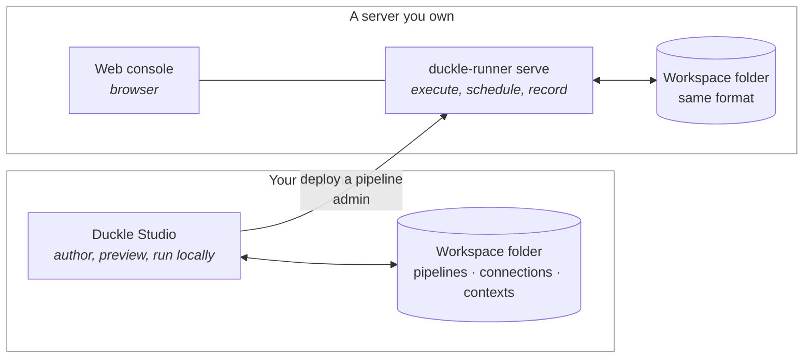
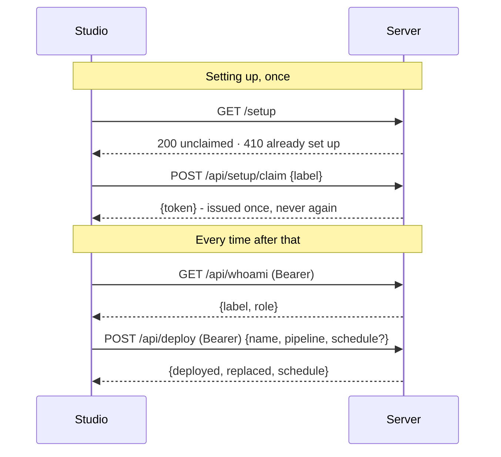
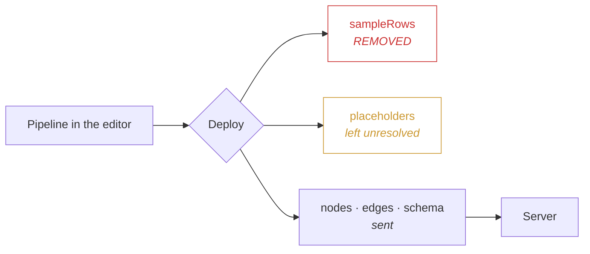
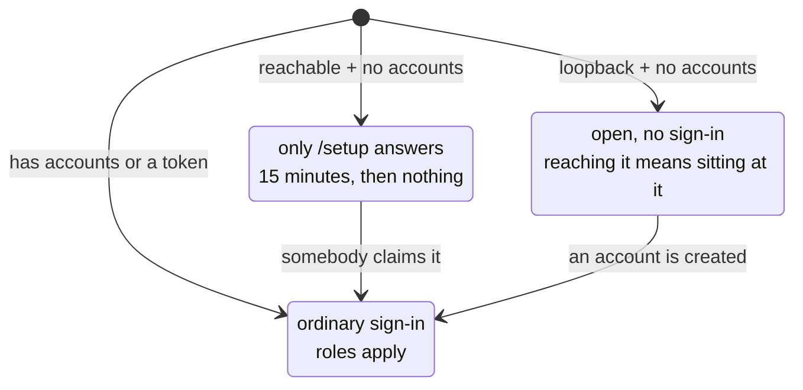
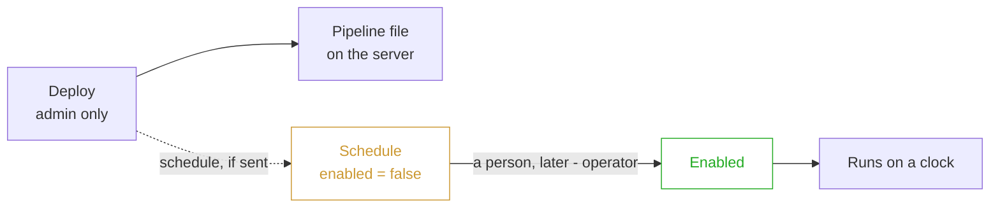
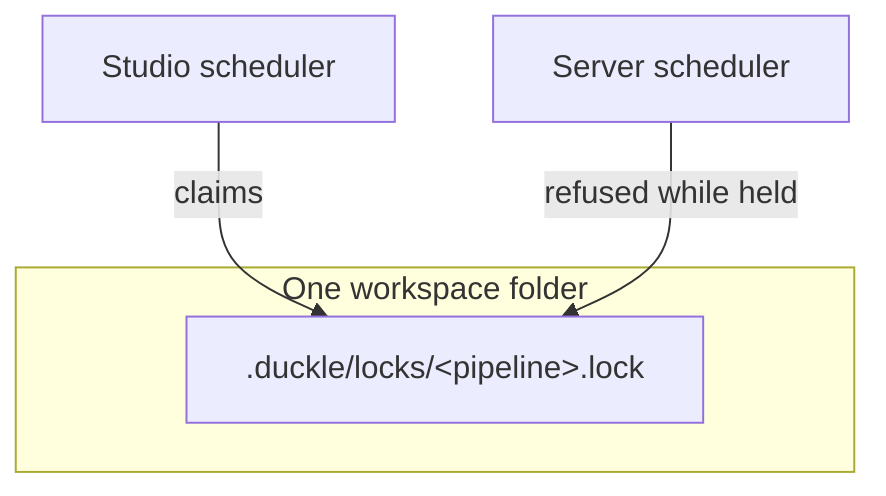

# How the Studio and the Server Fit Together

Duckle is two programs that share one folder format. This page is the map: which one does what, what moves between them, what is stored where, and who is allowed to do what.

It exists because "deploy it to your server" is a sentence that should not require trust. Everything below is checkable against your own disk and your own network log.

---

## 1. The two halves

**The studio** is where pipelines are written. It previews, runs locally, and can send a pipeline to a server. It never becomes a server.

**The runner** is where pipelines run when nobody is looking. It schedules, records history, raises alerts, and serves the console.

Neither is required by the other. The studio alone is a complete local ETL tool; the runner alone is a complete headless one. The connection between them is optional and one-directional: **the studio pushes to the server; the server never reaches back into the studio.**

---

## 2. What actually moves

Exactly four requests go from the studio to a server. There is no persistent connection, no polling, and no channel the other way.

That is the entire protocol. `probe`, `claim`, `whoami`, `deploy`.

**Nothing is sent on a timer.** If you never press Deploy, the studio never contacts the server.

---

## 3. What is deliberately removed before sending

A pipeline you are editing holds more than the pipeline. Two things are stripped or never included:

**`sampleRows` are real rows from your real sources**, cached when you previewed a node. They are stripped by the same function that strips them before writing to disk. Deploying them would put live data on a server for no reason at all.

The Deploy dialog shows this rather than asserting it: before you send, it lists the node
and connection counts, the exact byte size, how many nodes had cached preview rows removed,
and offers the literal JSON that is about to leave. Nothing below has to be taken on trust.

**Placeholders stay placeholders.** The studio does not resolve `${...}` before sending, so your machine's absolute paths do not travel; the server re-resolves them against its own workspace. This is also why a pipeline written on Windows runs on a Linux server unchanged.

### Which of these actually keeps a secret out of the pipeline

This is the part to read twice, because one of the four is not what its name suggests.

| How you supply a credential | In the pipeline file? | Travels on deploy? |
| --- | :---: | :---: |
| `${ENV:NAME}` placeholder | the literal string only | **No** |
| A saved **Salesforce** connection | an id only (`connectionRef`) | **No** |
| Any **other** saved connection | **the decrypted value, copied in** | **Yes** |
| Typed straight into the field | **the value** | **Yes** |

**Picking a saved connection does not, by itself, protect the credential.** For every
connector except Salesforce, choosing a connection *copies* its `password`, `secretKey`,
`accessKey` and `accountKey` into that node's properties. From then on the secret is part
of the pipeline: written into `pipelines/<id>.json` in plaintext, committed if you commit
the workspace, and sent to the server when you deploy.

Salesforce is the exception because it stores a `connectionRef` - just an id - and the
host decrypts it at run time against *its own* connections.

**So: for anything secret, use `${ENV:NAME}`.** The placeholder travels as text and is
resolved on the server from the server's own environment, which is what you want anyway,
because production credentials should not be the ones on your laptop.

> **Deploy refuses to send one.** A pipeline carrying a credential in plain text under a
> secret-shaped key is rejected before anything leaves the machine, naming the node and the
> property so you know which field to change. `duckle-runner build` applies the same
> judgement when packaging an artifact, and both read it from one place so they cannot
> come to differ.

---

## 4. The three states a server can be in

A server decides what it is at startup, from two facts: does it have any accounts, and is it reachable from outside this machine.

**Local** is the ordinary case on your own machine. Asking for a password to protect against someone already sitting at your keyboard protects nothing.

**Unclaimed** is a server brought up in a cloud that nobody has finished setting up. For fifteen minutes, whoever reaches it first becomes its administrator. That window is the price of setup being a wizard instead of a shell session, and it is stated in the server's own startup log. After it closes the server answers nothing until restarted.

**Claimed** is normal operation.

---

## 5. Who may do what

Three roles. The split follows what an action can destroy, not which screen it lives on.

| | `viewer` | `operator` | `admin` |
| --- | :---: | :---: | :---: |
| Read dashboard, runs, logs, catalog | ● | ● | ● |
| Run a pipeline (`POST /api/run`) | | ● | ● |
| Change or enable a schedule | | ● | ● |
| **Deploy a pipeline** (`POST /api/deploy`) | | | ● |
| Manage people and keys | | | ● |
| Read the audit log | | | ● |

The line that matters: **deploying needs `admin`, enabling a schedule needs `operator`.** Shipping code to a host and deciding when trusted code runs are different sizes of decision, so a CI key can ship without being able to start anything.

A refusal says which role was needed and which you have.

---

## 6. Deployed code cannot start itself

This is the property to check if you are reviewing Duckle for a team.

A schedule sent with a pipeline **always arrives switched off**. The server forces it, regardless of what was sent. Nothing that arrives by deploy begins running until a human with the operator role turns it on.

So a compromised CI key can put a file on the server. It cannot make it run.

---

## 7. One folder, two programs

A workspace can be open in the studio and served by a runner at the same time - that is what it looks like mid-way through moving from a laptop to a server.

They co-ordinate through a lock file per pipeline, not through each other:

The lock is on the **pipeline**, not the schedule record, because the pipeline owns the sink and the incremental watermark. Two schedules pointed at one pipeline collide exactly as much as two processes do.

A run that cannot take the lock is skipped for that tick and reported, rather than queued or doubled. Running twice would mean two writes into the same sink and two advances of the same watermark - and the second is how a load silently skips rows.

---

## 8. Where things are stored

The question a reviewer actually asks is: **if someone copies this folder, what do they
get?** Here is the answer, file by file.

### On the server

| File | Holds | Form |
| --- | --- | --- |
| `.duckle/console.db` | accounts | **Argon2id** (v19, m=19 MiB, t=2, p=1, 16-byte salt) |
| `.duckle/console.db` | sessions, machine API keys | **SHA-256**, unsalted |
| `logs/audit.ndjson` | who did what | plaintext, but **never request bodies** |
| `runs/*.json` | run history | plaintext metadata: status, duration, rows |
| `<name>.json` | deployed pipelines | **plaintext** |

Unsalted SHA-256 is the right choice for sessions and API keys, and the wrong-sounding one:
those values are generated by Duckle with 256 bits of entropy, so there is no dictionary to
attack and a slow KDF would only cost time on every request. Account tokens *can* be chosen
by a person, which is why they get Argon2id instead.

The audit log deliberately records the route and the outcome but **not the body**, so run
parameters and deployed pipeline contents never end up in it.

### On your machine

| File | Holds | Form |
| --- | --- | --- |
| `connections/*.json` | connection secrets | **AES-256-GCM**, per-value, random 12-byte nonce |
| `.duckle/keys/secret.key` | the key that decrypts the above | **plaintext**, `0600` on Unix |
| `.duckle/secrets/git.json` | cached Git token | **AES-256-GCM**, `0600` on Unix |
| `.duckle/deploy-targets.json` | server API keys | **AES-256-GCM**, same key |
| `pipelines/*.json` | your pipelines | **plaintext** - including any credential copied in (see section 3) |
| `contexts/*.json` | context variables | **plaintext, even ones marked "secret"** |
| `.duckle/settings.json` | AI API key, proxy URL | **plaintext** |
| `runs/`, `logs/`, `batches/` | history and diagnostics | plaintext metadata |

### The sharp edges, stated rather than buried

**The key sits next to the ciphertext.** `.duckle/keys/secret.key` lives in the same folder
as the `connections/` files it protects. Encryption at rest here defends against someone
reading a stray file, a backup, or a git diff - **not** against someone who has the folder.
If you copy the workspace, you copy the ability to decrypt it.

**On Windows the key file has no ACL restriction.** On Unix it is created `0600`, atomically
at open time to avoid a world-readable window. Windows gets default inherited permissions.

**Context variables marked "secret" are stored in plaintext.** The flag drives *redaction in
the UI and in logs* - it does not encrypt anything on disk. Treat `contexts/*.json` as
readable.

**`.duckle/.gitignore` now covers the whole set**, and is re-asserted before every stage
rather than only at `git init`: `secrets/`, `keys/`, `locks/`, `settings.json`,
`deploy-targets.json` and the console database. Earlier builds wrote a shorter list and
never revisited it, so a workspace created before this change kept the old file; opening it
in a current build and staging anything repairs it. If you have such a workspace and do not
want to wait, check `git check-ignore -v .duckle/keys/secret.key` says it is ignored.

**Only 15 field names are encrypted in a connection.** The list is an explicit allowlist -
`password`, `secretKey`, `accessKey`, `accountKey` and so on. A credential you put in a
field with some other name is stored as plaintext.

**Nothing enforces HTTPS.** The studio accepts `http://` for a server address exactly as
readily as `https://`. On plain http the freshly minted administrator token crosses the
network in the clear at claim time. TLS certificates *are* verified when you do use https,
and there is no skip-verify escape hatch anywhere in the codebase - but choosing http is
your decision to make and Duckle will not stop you.

**A signed-in `viewer` can read a deployed pipeline's full JSON**, including any credential
copied into it. If pipelines carry literal secrets, `viewer` is not a safe read-only role.

**`secrets.enc`**, the encrypted secrets file a built artifact can carry, derives its key as
a bare SHA-256 of the passphrase with no KDF. A weak passphrase is brute-forceable. Use a
long random one.

### What Duckle never does

**No telemetry.** No analytics, no usage reporting, no crash reporting. There is no
PostHog, Mixpanel, Sentry, Amplitude or Segment anywhere in the codebase, and no endpoint
that reports what you do.

**One automatic outbound call exists, and only one:** three seconds after launch the desktop
asks GitHub's public releases API whether a newer Duckle exists. It sends nothing about you
or your work - it is an unauthenticated GET of a public URL. The in-place updater then
refuses to install anything whose SHA-256 is absent from the published checksums file, and
aborts on a mismatch.

**The AI assistant is local by default.** Chat goes to a bundled `llama-server` on
`127.0.0.1`. Pointing it at a remote endpoint is a deliberate change you make in Settings.

**The runner you deploy is not downloaded.** It is unpacked from inside the app, so what
runs on your server is the binary that shipped with the studio you are holding.

---

## Next steps

* [Running Duckle on a Server](server-deployment.md) - the twelve-step walkthrough
* [CI/CD and External Orchestrators](ci-and-orchestration.md) - promoting from a merge, and driving Duckle from Airflow
* Full cloud recipes: <https://duckle.org/deploy.html>
